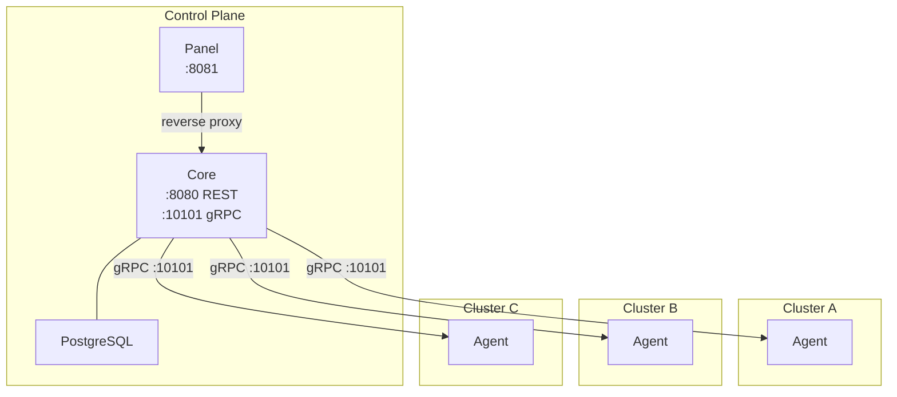

# PodDeck Deployment

Deploy [PodDeck](https://github.com/poddeck) — a multi-cluster Kubernetes management dashboard.

## Architecture



**Control Plane** — Core API + Panel UI + PostgreSQL. Deploy once on a VM or Kubernetes cluster.

**Agent** — One per managed cluster. Connects to the control plane via gRPC. Deploy after creating a cluster in the PodDeck UI.

---

## Option 1: Docker Compose

Best for VMs, bare metal, or local testing.

### Quick Start

```sh
git clone https://github.com/poddeck/poddeck-deployment.git
cd poddeck-deployment/docker
cp .env.example .env
```

Edit `.env` with your configuration:

```sh
# Generate JWT secrets
openssl rand -hex 16  # use for AUTH_KEY
openssl rand -hex 16  # use for REFRESH_KEY

# Set your database password
DB_PASSWORD=your-secure-password

# Set the hostname that agents will use to connect (must be reachable from K8s clusters)
GRPC_HOST=poddeck.example.com
```

Start the control plane:

```sh
docker compose up -d
```

Create your first user:

```sh
./create-user.sh
```

PodDeck is now accessible at `http://localhost:8081` (or the port configured in `PANEL_PORT`).

### Upgrade

Pull the latest images and restart the stack:

```sh
docker compose pull
docker compose down && docker compose up -d
```

### Ports

| Port | Service | Purpose |
|------|---------|---------|
| 8081 | Panel | Web UI |
| 10101 | Core (gRPC) | Agent connections — must be reachable from managed clusters |

---

## Option 2: Helm (Kubernetes)

Best for production deployments on Kubernetes.

### Prerequisites

- Helm 3.x
- A Kubernetes cluster for the control plane

### Install Control Plane

```sh
helm repo add poddeck https://poddeck.github.io/poddeck-deployment
helm repo update
```

Using the provided values file:

```sh
# Edit helm/values-control-plane.yaml with your settings
helm install poddeck poddeck/poddeck -f helm/values-control-plane.yaml
```

Or inline:

```sh
helm install poddeck poddeck/poddeck \
  --set postgresql.auth.password=your-db-password \
  --set core.grpcHost=poddeck.example.com
```

JWT keys are auto-generated if not provided.

### Install Agent (per cluster)

After deploying the control plane:

1. Open the PodDeck UI
2. Go to the **Cluster** page
3. Click **+ Add cluster**, fill in name and icon
4. The **Deploy Agent** dialog will show a Helm command with your cluster credentials pre-filled
5. Run the command in the target Kubernetes cluster

Or manually:

```sh
helm install poddeck-agent poddeck/poddeck-agent \
  --set core.hostname=poddeck.example.com \
  --set core.port=10101 \
  --set cluster.id=<CLUSTER_ID> \
  --set cluster.key=<AGENT_KEY>
```

The `cluster.id` and `cluster.key` are provided by the PodDeck UI when you create a cluster.

### Upgrade Agent

To upgrade an existing agent to a new image tag without losing its cluster credentials:

```sh
helm upgrade poddeck-agent poddeck/poddeck-agent \
  --reuse-values \
  --set image.tag=v1.0.0 \
  --set image.pullPolicy=IfNotPresent
```

`--reuse-values` preserves the previously set `cluster.id`, `cluster.key`, and `core.hostname`.

---

## GeoIP (Optional)

PodDeck can resolve login sessions to geographic locations using the [MaxMind GeoLite2](https://dev.maxmind.com/geoip/geolite2-free-geolocation-data) database. This is fully optional — without it, sessions will simply have empty country/city fields.

### Docker Compose

1. Download `GeoLite2-City.mmdb` from [MaxMind](https://www.maxmind.com/en/geolite2/signup) (free account required)
2. Place it at `docker/geo/GeoLite2-City.mmdb`
3. Uncomment the volume mount in `docker-compose.yml`:

```yaml
volumes:
  - ./geo/GeoLite2-City.mmdb:/app/geo/GeoLite2-City.mmdb:ro
```

### Helm

Mount the database file into the core pod at `/app/geo/GeoLite2-City.mmdb` using a ConfigMap, Secret, or PersistentVolume.

---

## Network Requirements

The gRPC port (default `10101`) on the control plane **must be reachable** from every managed Kubernetes cluster. Ensure:

- Firewall rules allow inbound TCP on the gRPC port
- DNS or IP is resolvable from the managed clusters
- For Helm deployments, the `core.grpcService.type: LoadBalancer` creates an external endpoint automatically

---

## Configuration Reference

### Docker (.env)

| Variable | Required | Default | Description |
|----------|----------|---------|-------------|
| `DB_PASSWORD` | Yes | — | PostgreSQL password |
| `AUTH_KEY` | Yes | — | JWT signing key (32 hex chars) |
| `REFRESH_KEY` | Yes | — | JWT refresh key (32 hex chars) |
| `GRPC_HOST` | Yes | `localhost` | Hostname for agent connections |
| `GRPC_PORT` | No | `10101` | gRPC port |
| `PANEL_PORT` | No | `8081` | Panel web UI port |
| `ALLOWED_ORIGINS` | No | `http://localhost` | CORS origins |
| `DB_USERNAME` | No | `poddeck` | PostgreSQL username |
| `DB_DATABASE` | No | `poddeck` | PostgreSQL database name |

### Helm (Control Plane)

See [`helm/values-control-plane.yaml`](helm/values-control-plane.yaml) for all available values.

### Helm (Agent)

See [`helm/values-agent.yaml`](helm/values-agent.yaml) for all available values.
